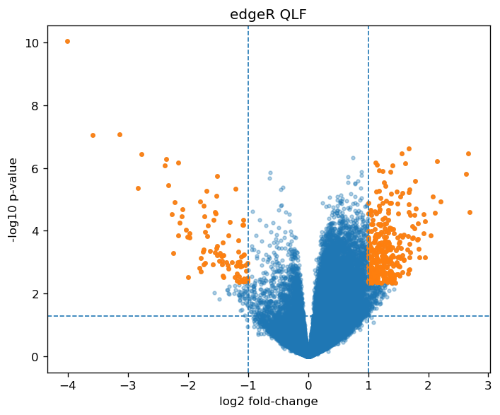
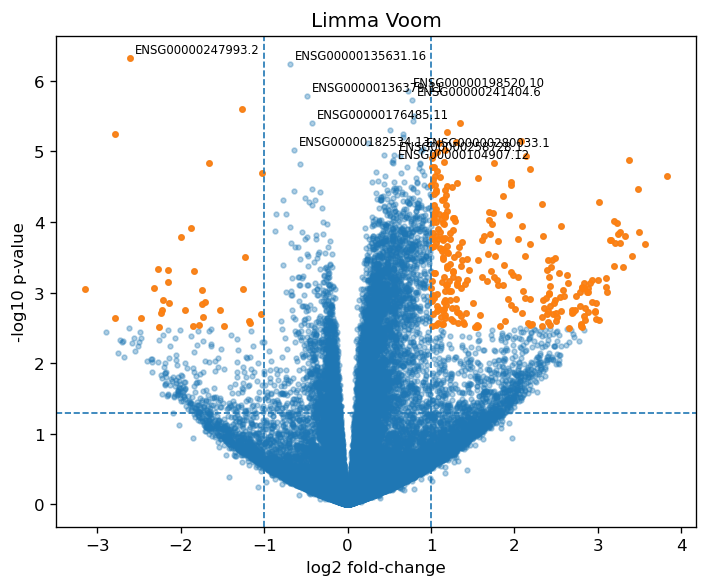

[](https://pypi.org/project/deferential_expression/)


# deferential_expression

> Python helpers to run **edgeR** and **limma** over R-backed `SummarizedExperiment` objects from Python (via `rpy2` + a lazy R env).  
R matrices stay R-backed with `RMatrixAdapter`, so slicing (`se[mask, :]`) happens in R and you can pass assays straight to edgeR/limma.


## Install

To get started, install the package from [PyPI](https://pypi.org/project/deferential_expression/)

```bash
pip install deferential_expression
```

<!-- biocsetup-notes -->

## Requirements

- **R** (≥ 4.x) with:
  - `recount3`, `edgeR`, `limma`
- **Python** (3.10+):
  - `rpy2`, `pandas`, `numpy`, `biocframe`, `summarizedexperiment`, `pyrtools`
  - this package: `deferential_expression`

Install R pkgs once:

```r
install.packages("BiocManager", repos="https://cloud.r-project.org")
BiocManager::install(c("recount3","edgeR","limma"), ask=FALSE, update=FALSE)
```
## Install (from sourse)
```
pip install -e .
# (optional) docs extras if you defined them:
# pip install -e ".[docs]"
```

## Quickstart: recount3 ➜ edgeR (all from Python)
The snippet below runs R code from Python to download SRP149978 with recount3, extracts raw counts + sample metadata, builds an R-backed container, and runs an edgeR quasi-likelihood (QL) pipeline.
```
import pandas as pd
from pyrtools.lazy_r_env import r  # lazy rpy2 env
import deferential_expression as de

# --- 1) Use recount3 in R to pull a moderate-sized project and make a 'condition' factor
r.ro.r("""
suppressMessages(library(recount3))
suppressMessages(library(stringr))

human_projects <- available_projects()
my_project <- subset(human_projects, project == "SRP149978" & project_type == "data_sources")
rse_gene <- create_rse(my_project)

rse_gene$condition <- rse_gene$sra.experiment_title |>
  stringr::str_split(":") |> sapply(function(x) x[2]) |>
  stringr::str_split(";") |> sapply(function(x) x[1]) |>
  stringr::str_split("_") |> sapply(function(x) x[1]) |>
  stringr::str_replace_all(" ", "") |>
  as.factor() |> relevel("Control")
""")

# --- 2) Pull counts (R matrix, stays R-backed) and colData (to pandas)
counts_r   = r.ro.r("assay(rse_gene, 'raw_counts')")
coldata_df = r.r2py(r.ro.r("as.data.frame(colData(rse_gene))"))

# --- 3) Build an EdgeR container with R-backed counts
edg = de.edger.EdgeR(
    assays={"counts": counts_r},
    column_data=coldata_df,   # pandas DataFrame
)

# --- 4) Design, filter, fit, test
# design with dummy coding for the 'condition' factor created above
design = pd.get_dummies(coldata_df[['condition']], drop_first=False).astype(float)

# filter genes by expression
mask = de.edger.filter_by_expr(edg, design=design, assay="counts")
edg = edg[mask, :]

# estimate dispersion & fit GLM-Q
edg = edg.estimate_disp(design=design)
edg = edg.glm_ql_fit()

# test — choose coef index/name according to your design matrix
edg = edg.glm_qlf_test(coef=1)

# table of results (all genes): columns = gene, log_fc, p_value, adj_p_value
edg, tt = edg.top_tags(n=None)
print(tt.head())

###

import numpy as np
import matplotlib.pyplot as plt
from pathlib import Path

def volcano(
    df,
    *,
    log_fc_col="log_fc",
    p_col="p_value",
    adj_col="adj_p_value",
    lfc_thresh=1.0,
    alpha=0.05,
    title="Volcano",
    outpath=None,
    top_labels=10,
):
    """Simple volcano plot; saves to PNG if outpath is given."""
    x = df[log_fc_col].to_numpy()
    y = -np.log10(np.clip(df[p_col].to_numpy(), 1e-300, None))
    sig = (df[adj_col] < alpha) & (np.abs(df[log_fc_col]) >= lfc_thresh)

    plt.figure(figsize=(6, 5), dpi=120)
    plt.scatter(x, y, s=8, alpha=0.35)
    plt.scatter(x[sig], y[sig], s=10, alpha=0.9)
    plt.axvline(+lfc_thresh, ls="--", lw=1)
    plt.axvline(-lfc_thresh, ls="--", lw=1)
    plt.axhline(-np.log10(alpha), ls="--", lw=1)
    plt.xlabel("log2 fold-change")
    plt.ylabel("-log10 p-value")
    plt.title(title)
    plt.tight_layout()

    if top_labels and "gene" in df.columns:
        top = df.sort_values(adj_col, ascending=True).head(top_labels)
        for _, row in top.iterrows():
            gx = row[log_fc_col]
            gy = -np.log10(max(row[p_col], 1e-300))
            plt.annotate(str(row["gene"]), (gx, gy),
                         xytext=(3, 3), textcoords="offset points", fontsize=7)

    if outpath:
        Path(outpath).parent.mkdir(parents=True, exist_ok=True)
        plt.savefig(outpath, bbox_inches="tight")
        plt.close()

# After computing 'tt' above:
volcano(tt, title="edgeR QLF", outpath="figures/volcano_edger.png")
```



## Limma voom variant
```
# voom: log-CPM + weights (writes assays 'log_expr' and 'weights')
se2 = de.limma.voom(edg, design=design, log_expr_assay="log_expr", weights_assay="weights")

# optional between-array normalization
se2 = de.limma.normalize_between_arrays(se2, exprs_assay="log_expr", normalized_assay="log_expr_norm")

# lmFit → contrasts → eBayes → topTable
se2 = de.limma.lm_fit(se2, design=design)
se2 = de.limma.contrasts_fit(se2, contrast=[0, 1])  # example only
tt_limma = de.limma.top_table(se2, n=20)
```


## Note

This project has been set up using [BiocSetup](https://github.com/biocpy/biocsetup)
and [PyScaffold](https://pyscaffold.org/).
